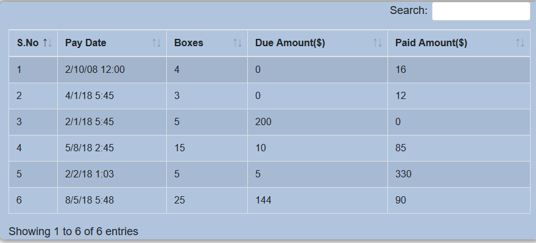

# Panther with Bootstrap Datatables
This sample contains a responsive Panther Grid/Bootstrap Datatable screen.The sample also demostrates a JQuery Click event on a row.

# Prerequisite
  * Panther Web 5.5*
  * Apache  Web Server

# This repository consists of the following files
  * main.css
  * pyordr.html
  * pyordr.jpl
  * pyordr.js
  * pyordr.scr
  * next.scr
  * cookie database file
  
# pyordr.scr
Panther screen containing a grid. Pyordr.html is attached as an HTML template.

# next.scr
The Next Panther screen

# Pyordr.jpl
Jpl code which is included in the Panther screen. 

# pyordr.html
HTML template that is included in the Panther screen. The HTML will generate a user-defined UI for the screen. Main.css and pyordr.js are referenced in the HTML template.
Our Migration Utility(Panther 5.52)  was used to generate this HTML template

# pyordr.js
Javascript File created by the Migration Utility contains refereces to Bootstrap libraries, making it a responsive web screen

# cookie database file
JDB database containing  data used to populate Panther Grids/Datatables.

# Videos and Links

Need a Panther Web 552 Redhat Image? [Click Here](https://hub.docker.com/r/prolificspanther/pantherweb)

[Click Here](https://www.prolifics.com/panther-trial-license-request) for a 45 day license.

How to setup a Panther Servlet Web Application? [Click Here](https://github.com/ProlificsPanther/PantherWeb/releases)
